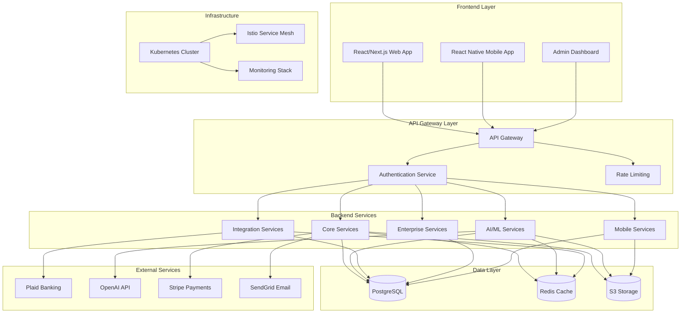

# VeriGrade Bookkeeping Platform - Architecture Diagram

## System Architecture Overview

## Service Architecture

### Core Services
- **Authentication & Authorization**: JWT, OAuth 2.0, SAML 2.0
- **User Management**: Multi-tenant, RBAC, SSO
- **Transaction Processing**: Real-time, batch processing
- **File Management**: S3/CloudFlare R2, OCR processing
- **Reporting Engine**: Custom reports, scheduled reports

### AI/ML Services
- **Predictive Analytics**: Revenue forecasting, churn prediction
- **Document Intelligence**: OCR, contract analysis, receipt processing
- **Fraud Detection**: Anomaly detection, pattern recognition
- **ML Categorization**: Auto-categorization, confidence scoring
- **AI Co-Pilot**: Intelligent insights, recommendations

### Integration Services
- **Banking**: Plaid integration, bank feeds, reconciliation
- **Third-Party**: QuickBooks, Xero, Shopify, Salesforce
- **Payment Processing**: Stripe, PayPal, ACH
- **Communication**: Email, SMS, Slack notifications

### Enterprise Services
- **Multi-Company Management**: Organization hierarchy
- **White-Label Branding**: Custom branding, themes
- **API Platform**: Public APIs, webhooks, SDKs
- **Compliance**: SOC 2, GDPR, PCI DSS automation

### Mobile Services
- **Offline Sync**: Conflict resolution, data synchronization
- **Mobile Payments**: NFC, mobile wallets
- **GPS Tracking**: Mileage tracking, location services
- **Biometric Auth**: Fingerprint, face recognition

## Data Architecture

### Database Design
- **PostgreSQL**: Primary database with ACID compliance
- **Redis**: Caching, session storage, rate limiting
- **S3/CloudFlare R2**: File storage, backups, CDN

### Data Models
- **Core Entities**: Users, Organizations, Transactions, Invoices
- **Financial**: Revenue, Expenses, Assets, Liabilities
- **Inventory**: Products, Stock, Purchase Orders, COGS
- **Time Tracking**: Projects, Tasks, Time Entries, Timesheets
- **AI/ML**: Models, Predictions, Training Data, Analytics

## Security Architecture

### Authentication & Authorization
- **Multi-Factor Authentication**: TOTP, SMS, biometric
- **OAuth 2.0**: Third-party integrations
- **SAML 2.0**: Enterprise SSO
- **JWT Tokens**: Stateless authentication

### Data Protection
- **Encryption**: AES-256 at rest, TLS 1.3 in transit
- **Audit Trails**: Immutable logs, SHA-256 hashing
- **GDPR Compliance**: Data subject rights, consent management
- **PCI DSS**: Payment card data protection

### Infrastructure Security
- **Network Security**: VPC, security groups, WAF
- **Container Security**: Image scanning, runtime protection
- **Secrets Management**: AWS Secrets Manager, HashiCorp Vault
- **Monitoring**: SIEM, threat detection, incident response

## Deployment Architecture

### Kubernetes Cluster
- **Control Plane**: High availability, auto-scaling
- **Worker Nodes**: Multi-AZ deployment, auto-scaling
- **Service Mesh**: Istio for traffic management, mTLS
- **Ingress**: NGINX Ingress Controller with SSL termination

### CI/CD Pipeline
- **Source Control**: GitHub with branch protection
- **Build**: Docker containerization, multi-stage builds
- **Testing**: Unit, integration, E2E, load testing
- **Deployment**: Blue-green, canary, automated rollbacks

### Monitoring & Observability
- **APM**: New Relic/Datadog for application monitoring
- **Logging**: ELK Stack/Grafana Loki for centralized logging
- **Metrics**: Prometheus with Grafana dashboards
- **Tracing**: Jaeger for distributed tracing
- **Alerting**: AlertManager with PagerDuty integration

## Scalability & Performance

### Horizontal Scaling
- **Microservices**: Independent scaling of services
- **Load Balancing**: Application and database load balancing
- **Caching**: Redis cluster, CDN integration
- **Database**: Read replicas, connection pooling

### Performance Optimization
- **Code Splitting**: Frontend bundle optimization
- **Database**: Query optimization, indexing, partitioning
- **Caching**: Multi-level caching strategy
- **CDN**: Global content delivery network

## Disaster Recovery

### Backup Strategy
- **Database**: Automated daily backups, point-in-time recovery
- **Files**: S3 versioning, cross-region replication
- **Configuration**: Infrastructure as Code, GitOps

### High Availability
- **Multi-AZ**: Database and application redundancy
- **Failover**: Automated failover with health checks
- **RTO/RPO**: Recovery Time Objective < 1 hour, RPO < 15 minutes

## Compliance & Governance

### Regulatory Compliance
- **SOC 2 Type II**: Security, availability, processing integrity
- **GDPR**: Data protection, privacy by design
- **PCI DSS**: Payment card industry compliance
- **HIPAA**: Healthcare data protection (if applicable)

### Data Governance
- **Data Classification**: Sensitive data identification
- **Access Controls**: Role-based access, least privilege
- **Audit Logging**: Comprehensive activity tracking
- **Data Retention**: Automated data lifecycle management

