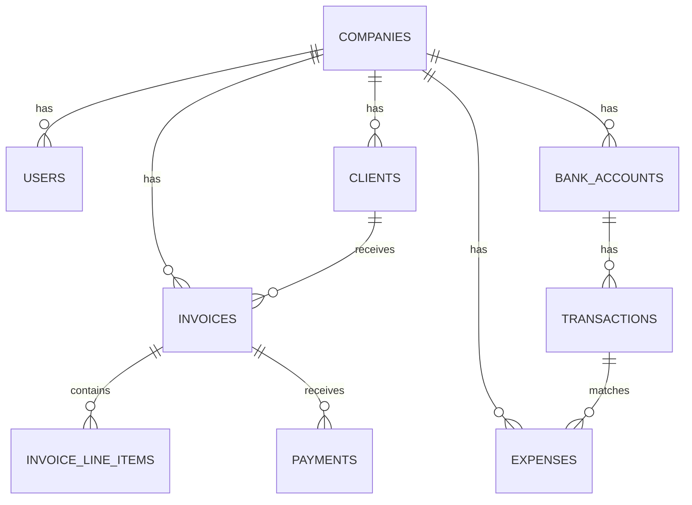

# VeriGrade System Architecture

This document provides a comprehensive overview of the VeriGrade bookkeeping platform's system architecture, including technical components, data flow, and infrastructure design.

## Table of Contents

1. [System Overview](#system-overview)
2. [Architecture Principles](#architecture-principles)
3. [Technology Stack](#technology-stack)
4. [Component Architecture](#component-architecture)
5. [Data Architecture](#data-architecture)
6. [Security Architecture](#security-architecture)
7. [Deployment Architecture](#deployment-architecture)
8. [Scalability Considerations](#scalability-considerations)
9. [Monitoring & Observability](#monitoring--observability)

## System Overview

VeriGrade is a cloud-native, microservices-based SaaS platform designed for comprehensive bookkeeping and financial management. The system is built with scalability, security, and maintainability as core principles.

### High-Level Architecture

```
┌─────────────────────────────────────────────────────────────┐
│                    Client Layer                             │
├─────────────────────────────────────────────────────────────┤
│  Web App (React)  │  Mobile App (RN)  │  API Clients      │
└─────────────────────────────────────────────────────────────┘
                                │
┌─────────────────────────────────────────────────────────────┐
│                    API Gateway                             │
├─────────────────────────────────────────────────────────────┤
│  Load Balancer  │  Rate Limiting  │  Authentication       │
└─────────────────────────────────────────────────────────────┘
                                │
┌─────────────────────────────────────────────────────────────┐
│                  Microservices Layer                       │
├─────────────────────────────────────────────────────────────┤
│  Auth Service  │  User Service  │  Invoice Service        │
│  Banking Svc  │  Report Svc    │  Integration Svc        │
│  OCR Service   │  AI Service    │  Notification Svc       │
└─────────────────────────────────────────────────────────────┘
                                │
┌─────────────────────────────────────────────────────────────┐
│                    Data Layer                               │
├─────────────────────────────────────────────────────────────┤
│  PostgreSQL  │  Redis  │  S3/R2  │  Elasticsearch         │
└─────────────────────────────────────────────────────────────┘
```

## Architecture Principles

### 1. Microservices Architecture
- **Service Independence** - Each service operates independently
- **Technology Diversity** - Services can use different technologies
- **Fault Isolation** - Service failures don't cascade
- **Independent Scaling** - Scale services based on demand

### 2. Domain-Driven Design (DDD)
- **Bounded Contexts** - Clear service boundaries
- **Domain Models** - Business logic encapsulation
- **Aggregate Roots** - Data consistency boundaries
- **Event Sourcing** - Audit trail and state reconstruction

### 3. Event-Driven Architecture
- **Asynchronous Communication** - Loose coupling between services
- **Event Sourcing** - Complete audit trail
- **CQRS** - Command Query Responsibility Segregation
- **Event Streaming** - Real-time data processing

### 4. API-First Design
- **RESTful APIs** - Standard HTTP methods and status codes
- **GraphQL** - Flexible data querying
- **OpenAPI/Swagger** - Comprehensive API documentation
- **Versioning** - Backward compatibility management

## Technology Stack

### Frontend Technologies

**Web Application:**
- **React 18** - Component-based UI library
- **TypeScript** - Type-safe JavaScript
- **Material-UI** - Component library
- **Redux Toolkit** - State management
- **React Query** - Server state management
- **React Router** - Client-side routing

**Mobile Application:**
- **React Native** - Cross-platform mobile development
- **Expo** - Development platform and tools
- **React Navigation** - Navigation library
- **AsyncStorage** - Local data persistence
- **React Native Camera** - Camera integration

### Backend Technologies

**Core Backend:**
- **Node.js** - JavaScript runtime
- **Express.js** - Web application framework
- **TypeScript** - Type-safe development
- **Prisma** - Database ORM
- **Jest** - Testing framework
- **Winston** - Logging library

**Database & Storage:**
- **PostgreSQL** - Primary relational database
- **Redis** - Caching and session storage
- **S3/CloudFlare R2** - Object storage
- **Elasticsearch** - Search and analytics

**Message Queue & Streaming:**
- **RabbitMQ** - Message broker
- **Apache Kafka** - Event streaming platform
- **Redis Pub/Sub** - Real-time messaging

### Infrastructure & DevOps

**Containerization:**
- **Docker** - Application containerization
- **Docker Compose** - Local development
- **Kubernetes** - Container orchestration

**Cloud Platforms:**
- **AWS** - Primary cloud provider
- **CloudFlare** - CDN and security
- **DigitalOcean** - Secondary cloud provider

**CI/CD:**
- **GitHub Actions** - Continuous integration
- **Docker Registry** - Container image storage
- **Helm** - Kubernetes package management

## Component Architecture

### API Gateway
Central entry point for all client requests.

**Responsibilities:**
- **Request Routing** - Route requests to appropriate services
- **Authentication** - JWT token validation
- **Rate Limiting** - Prevent API abuse
- **Load Balancing** - Distribute traffic across services
- **CORS Handling** - Cross-origin request management

**Implementation:**
```typescript
// API Gateway Configuration
const gatewayConfig = {
  routes: [
    { path: '/api/auth/*', service: 'auth-service' },
    { path: '/api/users/*', service: 'user-service' },
    { path: '/api/invoices/*', service: 'invoice-service' },
    { path: '/api/banking/*', service: 'banking-service' }
  ],
  middleware: [
    'authentication',
    'rateLimiting',
    'cors',
    'logging'
  ]
};
```

### Authentication Service
Handles user authentication and authorization.

**Features:**
- **JWT Tokens** - Stateless authentication
- **OAuth 2.0** - Third-party authentication
- **SAML 2.0** - Enterprise SSO
- **Multi-Factor Authentication** - Enhanced security
- **Session Management** - User session tracking

**Database Schema:**
```sql
-- Users table
CREATE TABLE users (
  id UUID PRIMARY KEY DEFAULT gen_random_uuid(),
  email VARCHAR(255) UNIQUE NOT NULL,
  password_hash VARCHAR(255) NOT NULL,
  first_name VARCHAR(100),
  last_name VARCHAR(100),
  role VARCHAR(50) DEFAULT 'user',
  is_active BOOLEAN DEFAULT true,
  created_at TIMESTAMP DEFAULT NOW(),
  updated_at TIMESTAMP DEFAULT NOW()
);

-- Sessions table
CREATE TABLE user_sessions (
  id UUID PRIMARY KEY DEFAULT gen_random_uuid(),
  user_id UUID REFERENCES users(id),
  token_hash VARCHAR(255) NOT NULL,
  expires_at TIMESTAMP NOT NULL,
  created_at TIMESTAMP DEFAULT NOW()
);
```

### Invoice Service
Manages invoice creation, processing, and lifecycle.

**Core Features:**
- **Invoice CRUD** - Create, read, update, delete operations
- **Line Item Management** - Detailed invoice line items
- **Tax Calculations** - Automatic tax computation
- **Payment Processing** - Payment recording and tracking
- **Template System** - Reusable invoice templates

**Service Architecture:**
```typescript
// Invoice Service Structure
class InvoiceService {
  async createInvoice(data: CreateInvoiceRequest): Promise<Invoice> {
    // Validate input data
    const validatedData = await this.validateInvoiceData(data);
    
    // Calculate totals
    const totals = await this.calculateTotals(validatedData.lineItems);
    
    // Create invoice
    const invoice = await this.invoiceRepository.create({
      ...validatedData,
      ...totals,
      status: 'draft'
    });
    
    // Emit event
    await this.eventBus.emit('invoice.created', invoice);
    
    return invoice;
  }
}
```

### Banking Service
Handles bank account connections and transaction processing.

**Features:**
- **Plaid Integration** - Bank account connections
- **Transaction Import** - Automatic transaction sync
- **Reconciliation** - Bank statement reconciliation
- **Multi-Account Support** - Multiple bank accounts
- **Transaction Categorization** - Automatic categorization

**Integration Flow:**
```
Client Request → Banking Service → Plaid API → Bank
     ↓
Transaction Data → Processing Queue → Database
     ↓
Categorization Service → AI/ML Processing → Categorized Data
```

### OCR Service
Document processing and data extraction.

**Components:**
- **Document Upload** - File upload and validation
- **OCR Processing** - Text extraction from images
- **Data Extraction** - Structured data extraction
- **Confidence Scoring** - Accuracy assessment
- **Manual Review** - Human verification queue

**Processing Pipeline:**
```typescript
// OCR Processing Pipeline
class OCRService {
  async processDocument(file: UploadedFile): Promise<ExtractedData> {
    // 1. Preprocess image
    const processedImage = await this.preprocessImage(file);
    
    // 2. Extract text
    const extractedText = await this.extractText(processedImage);
    
    // 3. Parse structured data
    const structuredData = await this.parseData(extractedText);
    
    // 4. Calculate confidence
    const confidence = await this.calculateConfidence(structuredData);
    
    // 5. Queue for review if low confidence
    if (confidence < 0.8) {
      await this.queueForReview(structuredData);
    }
    
    return structuredData;
  }
}
```

## Data Architecture

### Database Design
PostgreSQL as the primary database with optimized schema design.

**Core Tables:**
```sql
-- Users and authentication
CREATE TABLE users (
  id UUID PRIMARY KEY DEFAULT gen_random_uuid(),
  email VARCHAR(255) UNIQUE NOT NULL,
  password_hash VARCHAR(255) NOT NULL,
  first_name VARCHAR(100),
  last_name VARCHAR(100),
  company_id UUID REFERENCES companies(id),
  role VARCHAR(50) DEFAULT 'user',
  is_active BOOLEAN DEFAULT true,
  created_at TIMESTAMP DEFAULT NOW(),
  updated_at TIMESTAMP DEFAULT NOW()
);

-- Companies and organizations
CREATE TABLE companies (
  id UUID PRIMARY KEY DEFAULT gen_random_uuid(),
  name VARCHAR(255) NOT NULL,
  business_type VARCHAR(100),
  tax_id VARCHAR(50),
  address JSONB,
  settings JSONB,
  created_at TIMESTAMP DEFAULT NOW(),
  updated_at TIMESTAMP DEFAULT NOW()
);

-- Invoices
CREATE TABLE invoices (
  id UUID PRIMARY KEY DEFAULT gen_random_uuid(),
  company_id UUID REFERENCES companies(id),
  client_id UUID REFERENCES clients(id),
  invoice_number VARCHAR(100) NOT NULL,
  status VARCHAR(50) DEFAULT 'draft',
  total_amount DECIMAL(15,2) NOT NULL,
  due_date DATE,
  created_at TIMESTAMP DEFAULT NOW(),
  updated_at TIMESTAMP DEFAULT NOW()
);

-- Invoice line items
CREATE TABLE invoice_line_items (
  id UUID PRIMARY KEY DEFAULT gen_random_uuid(),
  invoice_id UUID REFERENCES invoices(id),
  description TEXT NOT NULL,
  quantity DECIMAL(10,2) NOT NULL,
  unit_price DECIMAL(15,2) NOT NULL,
  tax_rate DECIMAL(5,4) DEFAULT 0,
  line_total DECIMAL(15,2) NOT NULL,
  created_at TIMESTAMP DEFAULT NOW()
);
```

### Data Relationships


### Caching Strategy
Redis for high-performance caching and session management.

**Cache Layers:**
1. **Application Cache** - In-memory application caching
2. **Redis Cache** - Distributed caching layer
3. **CDN Cache** - Static asset caching
4. **Database Cache** - Query result caching

**Cache Implementation:**
```typescript
// Cache Service Implementation
class CacheService {
  async get<T>(key: string): Promise<T | null> {
    const cached = await this.redis.get(key);
    return cached ? JSON.parse(cached) : null;
  }
  
  async set(key: string, value: any, ttl: number = 3600): Promise<void> {
    await this.redis.setex(key, ttl, JSON.stringify(value));
  }
  
  async invalidate(pattern: string): Promise<void> {
    const keys = await this.redis.keys(pattern);
    if (keys.length > 0) {
      await this.redis.del(...keys);
    }
  }
}
```

## Security Architecture

### Authentication & Authorization
Multi-layered security approach with JWT tokens and role-based access control.

**Security Layers:**
1. **API Gateway** - Request validation and rate limiting
2. **Authentication Service** - User authentication
3. **Authorization Middleware** - Permission checking
4. **Data Access Layer** - Database-level security

**JWT Token Structure:**
```typescript
// JWT Payload Structure
interface JWTPayload {
  sub: string;        // User ID
  email: string;      // User email
  role: string;       // User role
  companyId: string;  // Company ID
  permissions: string[]; // User permissions
  iat: number;        // Issued at
  exp: number;        // Expires at
}
```

### Data Encryption
End-to-end encryption for sensitive data.

**Encryption Levels:**
- **Transport Encryption** - TLS 1.3 for data in transit
- **Database Encryption** - AES-256 for data at rest
- **Application Encryption** - Field-level encryption
- **File Encryption** - Encrypted file storage

### Security Headers
Comprehensive security headers for web application protection.

```typescript
// Security Headers Configuration
const securityHeaders = {
  'Strict-Transport-Security': 'max-age=31536000; includeSubDomains',
  'X-Content-Type-Options': 'nosniff',
  'X-Frame-Options': 'DENY',
  'X-XSS-Protection': '1; mode=block',
  'Content-Security-Policy': "default-src 'self'",
  'Referrer-Policy': 'strict-origin-when-cross-origin'
};
```

## Deployment Architecture

### Container Orchestration
Kubernetes-based deployment with microservices architecture.

**Kubernetes Components:**
- **Pods** - Container instances
- **Services** - Load balancing and service discovery
- **Ingress** - External traffic routing
- **ConfigMaps** - Configuration management
- **Secrets** - Sensitive data management

**Deployment Configuration:**
```yaml
# Kubernetes Deployment Example
apiVersion: apps/v1
kind: Deployment
metadata:
  name: invoice-service
spec:
  replicas: 3
  selector:
    matchLabels:
      app: invoice-service
  template:
    metadata:
      labels:
        app: invoice-service
    spec:
      containers:
      - name: invoice-service
        image: verigrade/invoice-service:latest
        ports:
        - containerPort: 3000
        env:
        - name: DATABASE_URL
          valueFrom:
            secretKeyRef:
              name: database-secret
              key: url
        resources:
          requests:
            memory: "256Mi"
            cpu: "250m"
          limits:
            memory: "512Mi"
            cpu: "500m"
```

### CI/CD Pipeline
Automated deployment pipeline with GitHub Actions.

**Pipeline Stages:**
1. **Code Commit** - Trigger pipeline
2. **Build** - Docker image creation
3. **Test** - Automated testing
4. **Security Scan** - Vulnerability scanning
5. **Deploy** - Kubernetes deployment
6. **Health Check** - Service validation

**GitHub Actions Workflow:**
```yaml
# CI/CD Pipeline
name: Deploy to Production
on:
  push:
    branches: [main]

jobs:
  deploy:
    runs-on: ubuntu-latest
    steps:
      - uses: actions/checkout@v3
      - name: Build Docker Image
        run: docker build -t verigrade/api:${{ github.sha }} .
      - name: Run Tests
        run: npm test
      - name: Security Scan
        run: trivy image verigrade/api:${{ github.sha }}
      - name: Deploy to Kubernetes
        run: kubectl apply -f k8s/
```

## Scalability Considerations

### Horizontal Scaling
Microservices architecture enables independent scaling.

**Scaling Strategies:**
- **Auto-scaling** - Kubernetes HPA based on metrics
- **Load Balancing** - Distribute traffic across instances
- **Database Sharding** - Horizontal database partitioning
- **CDN Integration** - Global content delivery

### Performance Optimization
Multiple layers of performance optimization.

**Optimization Techniques:**
- **Database Indexing** - Optimized query performance
- **Query Optimization** - Efficient database queries
- **Caching** - Multi-layer caching strategy
- **CDN** - Static asset delivery
- **Connection Pooling** - Database connection management

### Monitoring & Observability
Comprehensive monitoring and alerting system.

**Monitoring Stack:**
- **Prometheus** - Metrics collection
- **Grafana** - Visualization and dashboards
- **ELK Stack** - Log aggregation and analysis
- **Jaeger** - Distributed tracing
- **AlertManager** - Alert management

**Key Metrics:**
- **Application Metrics** - Response time, error rate, throughput
- **Infrastructure Metrics** - CPU, memory, disk usage
- **Business Metrics** - User activity, revenue, growth
- **Security Metrics** - Failed logins, suspicious activity

---

This architecture provides a solid foundation for a scalable, secure, and maintainable bookkeeping platform. The microservices approach ensures flexibility and independent scaling, while the comprehensive security measures protect sensitive financial data.